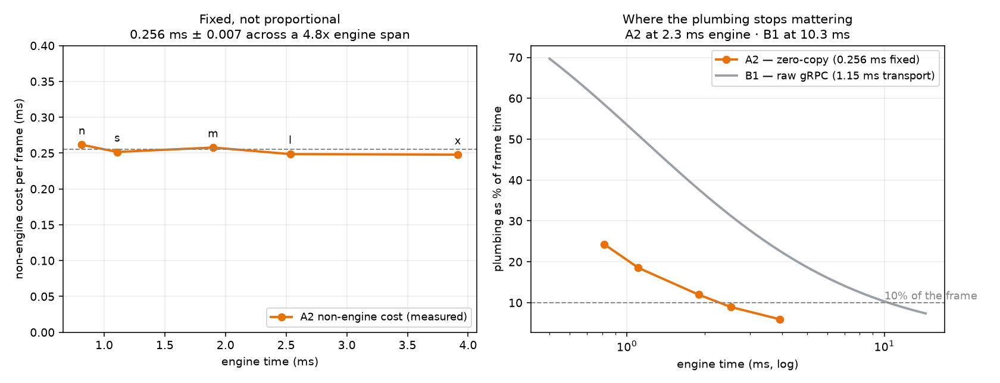

# Model cost — when does the plumbing stop mattering?

[← index](../README.md) · prev: [Stage decomposition](stage-decomposition.md) · next: [Batching](batching.md)

Every other number in this repo is YOLOv8s. That means every conclusion here is
stated at **one engine cost**, and the study's headline claim — *the GPU is
almost never the bottleneck at the edge* — has never been tested at the boundary
where it must stop being true.

This page finds the boundary.

Script: [`model_scaling.sh`](../scripts/model_scaling.sh) ·
figure: [`plot_model_scaling.py`](../scripts/plot_model_scaling.py) ·
raw data: [`results/v3/model_scaling.tsv`](../results/v3/model_scaling.tsv)
(3 interleaved repeats per model, capacity mode, A2, batch 1).

---

## The ladder

One family on purpose. YOLO11 n/s/m/l/x share an output shape, an NMS and a
launch pattern, so **only cost varies and nothing is confounded**. `yolov8s`
rides along as the control that ties this sweep to every published number.

| Model | A2 fps | engine (ms) | p50 (ms) | non-engine (ms) | non-engine share |
|---|---|---|---|---|---|
| YOLO11n | 923.3 | 0.816 | 1.077 | 0.2617 | **24.3%** |
| YOLO11s | 731.8 | 1.107 | 1.358 | 0.2516 | 18.5% |
| YOLO11m | 461.7 | 1.898 | 2.156 | 0.2578 | 12.0% |
| YOLO11l | 357.8 | 2.533 | 2.782 | 0.2486 | 8.9% |
| YOLO11x | 239.3 | 3.915 | 4.163 | 0.2478 | **6.0%** |
| *YOLOv8s (control)* | 791.5 | 0.992 | 1.259 | 0.2663 | 21.2% |

## The result: fixed, not proportional

> **Non-engine cost across the whole ladder: 0.2556 ms, sd 0.0068 — 2.7% of the
> mean, across a 4.80x span in engine time.**

It is not *roughly* constant. It is constant. The H2D copy moves the same
4.9 MB tensor whatever the model is, the compact kernel scans the same
`[1,84,8400]` output, and the host NMS sees a handful of boxes. None of that
knows or cares how expensive the engine was.

So the falling share in the right-hand plot is not the plumbing getting cheaper.
**It is the denominator growing.**

## Where it stops mattering

Take "under 10% of frame time" as the point where plumbing stops being worth
optimising. That threshold is not one number — it depends on **which pipeline you
already chose**:

| Flow | Fixed cost | Plumbing < 10% of the frame at |
|---|---|---|
| **A2** — zero-copy | 0.256 ms (measured here) | **engine > 2.30 ms** |
| **B1** — raw gRPC | 1.15 ms transport ([Transport](transport.md)) | **engine > 10.35 ms** |

A2 crosses over at **YOLO11m**, which is inside this ladder. B1 does not cross
until roughly four times further up the curve — somewhere around a SegFormer-B2.

That inverts the obvious reading. Fixing your transport does not only make the
pipeline faster; **it is what buys you the right to stop thinking about the
pipeline at all.** Leave it broken and you keep paying attention to plumbing
across four times as much of the model range.

## The fixed cost eats part of your model choice

Across the ladder, engine time spans **4.80x** but delivered throughput spans only
**3.86x**. The gap is the fixed cost, and it means **~20% of what you gain by
choosing a smaller model never reaches you.**

The effect is worst exactly where people reach for it. Dropping YOLO11s → YOLO11n
buys 1.36x on the engine and delivers 1.26x in the pipeline. The lighter the
model, the worse the conversion — which is the same lesson as
[CUDA graphs](cuda-graphs.md) and [precision](precision.md) arriving from a third
direction: **a fixed cost you have not removed is a tax on every optimisation you
try afterwards.**

## What this page does not say

- **It is not an accuracy comparison.** Detections per frame swing wildly across
  the ladder on this footage (0.27 to 1.60), and that is genuine model behaviour —
  `ultralytics` on the identical tensors reproduces the same spread and the same
  ordering. It is content interacting with confidence, not a pipeline defect, and
  it costs at most 0.015 ms of NMS. Do not read the ladder for accuracy; read
  [Accuracy](accuracy.md).
- **The crossover is for a 640x640 detector on this GPU.** The *shape* of the
  argument generalises — a fixed cost divided by a growing denominator — but the
  2.30 ms number is this pipeline on this card.
- **It stops at 3.9 ms.** Everything above that, where the crossover conclusions
  would bite hardest, is extrapolation. See [Roadmap](roadmap.md).

---

[← index](../README.md) · prev: [Stage decomposition](stage-decomposition.md) · next: [Batching](batching.md)
