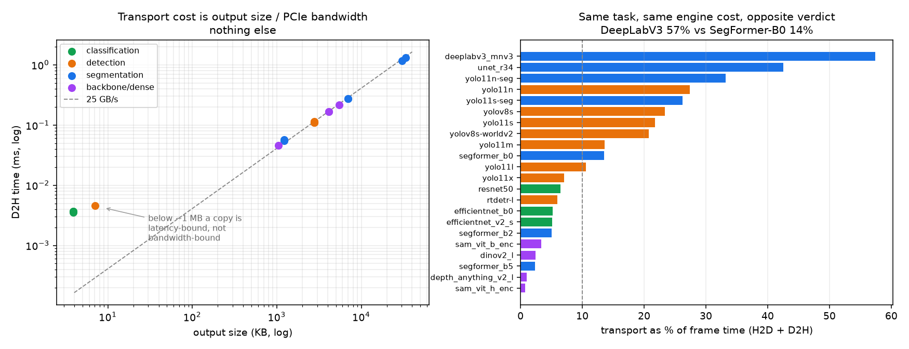

# Across architectures — what actually sets the plumbing cost

[← index](../README.md) · prev: [Model cost](model-scaling.md) · next: [Batching](batching.md)

[Model cost](model-scaling.md) held the architecture fixed and varied the price:
YOLO11 n through x, and the pipeline's non-engine work came out **constant at
0.256 ms**. This page does the opposite — it holds nothing fixed and sweeps
**22 models across four tasks**, from a 0.44 ms ResNet50 to an 82.6 ms SAM ViT-H.

And it shows that the earlier "fixed cost" was an artefact of the ladder.

Script: [`engine_sweep.py`](../scripts/engine_sweep.py) ·
exports: [`export_zoo.py`](../scripts/export_zoo.py),
[`ultra_export.sh`](../scripts/ultra_export.sh) ·
figure: [`plot_zoo.py`](../scripts/plot_zoo.py) ·
raw data: [`results/v3/model_zoo.tsv`](../results/v3/model_zoo.tsv)

> **These are engine-level numbers, not A2 pipeline numbers.** A2 is hardcoded to
> a 640x640 80-class YOLO head (`IMG`/`NUM_CLASSES`/`NUM_ANCHORS` in
> `cpp/src/main_cuda.cu`), so it cannot carry a classifier or a segmentation
> model. `trtexec` can, and it reports the split this page needs: H2D, GPU
> compute, D2H. Compare these rows to each other, **not** to the A2 columns in
> [model_scaling.tsv](../results/v3/model_scaling.tsv).

---

## Every model measured

All 22, cheapest engine first. `Transport` is (H2D + D2H) as a share of frame
time. Parameter counts come from the ONNX initializer dims; `Output` is the raw
tensor the engine writes, before any postprocessing.

<!-- BEGIN zoo-table -->

| Model | Task | Params | Input | Output | Engine | Transport |
|---|---|---:|---|---:|---:|---:|
| **ResNet50** | cls | 25.5 M | 224x224 | 3.9 KB | 0.438 ms | 6.4% |
| **EfficientNet-B0** | cls | 5.3 M | 224x224 | 3.9 KB | 0.542 ms | 5.2% |
| **YOLO11n** | det | 2.7 M | 640x640 | 2.7 MB | 0.805 ms | 27.4% |
| **YOLO11n-seg** | seg (inst) | 2.9 M | 640x640 | 6.8 MB | 0.935 ms | 33.2% |
| **YOLOv8s** | det | 11.2 M | 640x640 | 2.7 MB | 0.987 ms | 23.3% |
| **YOLO11s** | det | 9.5 M | 640x640 | 2.7 MB | 1.085 ms | 21.8% |
| **DeepLabV3-MNv3** | seg | 11.0 M | 640x640 | 32.8 MB | 1.120 ms | 57.4% |
| **YOLOv8s-World** | det (open-vocab) | 12.7 M | 640x640 | 2.7 MB | 1.148 ms | 20.8% |
| **SegFormer-B0** | seg | 3.7 M | 512x512 | 1.2 MB | 1.176 ms | 13.5% |
| **YOLO11s-seg** | seg (inst) | 10.1 M | 640x640 | 6.8 MB | 1.307 ms | 26.2% |
| **EfficientNetV2-S** | cls | 21.4 M | 384x384 | 3.9 KB | 1.369 ms | 5.2% |
| **U-Net-R34** | seg | 24.4 M | 640x640 | 29.7 MB | 1.818 ms | 42.6% |
| **YOLO11m** | det | 20.1 M | 640x640 | 2.7 MB | 1.909 ms | 13.6% |
| **YOLO11l** | det | 25.4 M | 640x640 | 2.7 MB | 2.545 ms | 10.6% |
| **RT-DETR-L** | det | 32.8 M | 640x640 | 7.0 KB | 3.042 ms | 6.0% |
| **SegFormer-B2** | seg | 27.4 M | 512x512 | 1.2 MB | 3.591 ms | 5.0% |
| **YOLO11x** | det | 57.0 M | 640x640 | 2.7 MB | 3.948 ms | 7.1% |
| **SegFormer-B5** | seg | 84.6 M | 512x512 | 1.2 MB | 8.018 ms | 2.3% |
| **DINOv2-L** | backbone | 304.4 M | 518x518 | 5.4 MB | 13.655 ms | 2.5% |
| **Depth Anything V2-L** | depth | 334.1 M | 518x518 | 1.0 MB | 17.273 ms | 1.0% |
| **SAM ViT-B (encoder)** | promptable | 89.7 M | 1024x1024 | 4.0 MB | 18.748 ms | 3.4% |
| **SAM ViT-H (encoder)** | promptable | 637.0 M | 1024x1024 | 4.0 MB | 82.644 ms | 0.8% |
| *SSDLite-MNv3* | det | 3.4 M | — | — | *build failed* | — |
| *Mask R-CNN R50* | seg (inst) | 44.5 M | — | — | *build failed* | — |

<!-- END zoo-table -->

*Generated from the raw data by [`gen_zoo_table.py`](../scripts/gen_zoo_table.py),
so this table cannot drift from
[`results/v3/model_zoo.tsv`](../results/v3/model_zoo.tsv).*

## 1. Transport cost is output bytes divided by PCIe bandwidth

That is the entire law. Across 18 models with outputs over 500 KB — four tasks,
CNNs and transformers, 0.9 ms to 83 ms engines — the implied D2H bandwidth is
**25.0 GB/s**, and no row deviates by more than a few percent.

| Model | output | D2H | implied |
|---|---|---|---|
| YOLO11x | 2,756 KB | 0.1113 ms | 25.4 GB/s |
| YOLO11n-seg | 7,006 KB | 0.2748 ms | 26.1 GB/s |
| DINOv2-L | 5,480 KB | 0.2154 ms | 26.1 GB/s |
| U-Net-R34 | 30,400 KB | 1.1576 ms | 26.9 GB/s |
| DeepLabV3-MNv3 | 33,600 KB | 1.3051 ms | 26.4 GB/s |

Below about 1 MB the relationship breaks — the classifiers and RT-DETR sit
*above* the line, because a 4 KB copy is **latency-bound, not bandwidth-bound**.
Their D2H floors out at ~0.0036 ms no matter how small the tensor gets.

## 2. So the "fixed cost" was never a property of the pipeline

The ladder measured 0.256 ms of non-engine work and found it constant to 2.7%.
It was constant **because every rung of a YOLO11 ladder ships the same
`[1,84,8400]` tensor.** Change architecture and it is not constant at all:

> **Output size across this sweep spans 8,602x** — 3.9 KB for a classifier,
> 33.6 MB for DeepLabV3. Engine time spans only 189x.

Your plumbing cost is **set by your output shape**, and output shape is an
architectural decision with no relationship to how expensive your model is.

## 3. The pair that proves it

| | engine | output | transport share |
|---|---|---|---|
| **SegFormer-B0** | 1.176 ms | **1.2 MB** | **13.5%** |
| **DeepLabV3-MNv3** | 1.120 ms | **33.6 MB** | **57.4%** |

Same task. Engine cost within 5% of each other. **27x the wire traffic.**

The difference is one architectural choice: SegFormer emits logits at quarter
resolution and leaves the upsample to the consumer; DeepLabV3 upsamples inside
the graph and ships the full-resolution result. DeepLabV3 therefore spends **more
time moving its answer than computing it** — 1.305 ms of D2H against 1.120 ms of
compute.

For any dense-prediction model, **where you put the upsample is a bigger
deployment decision than which backbone you picked.** Nothing else in this study
produces a 27x swing from a single line of graph construction.

## 4. RT-DETR: the same lever, pulled the other way

RT-DETR is NMS-free, so it emits `[1,300,6]`-shaped results rather than
`[1,84,8400]`. Output: **7.0 KB against YOLO's 2,756 KB, 394x smaller.** Its
transport share is 6.0% while YOLO11s at less than half the engine cost pays
21.8%.

This is [in-graph NMS](in-graph-nms.md) arriving as an architectural property
instead of a post-hoc engine edit — and it is free here, because the model was
designed that way rather than patched into it.

## 5. Does model size predict any of this?

Parameter counts are how people talk about model size, so it is worth asking what
they actually buy you here. The answer is more favourable than the folklore:

| Predictor | log-log r² against engine time |
|---|---|
| **parameters** | **0.800** |
| input pixels | 0.284 |
| **parameters × input pixels** | **0.901** |

Parameters alone explain 80% of the variance in engine time across 22 models
spanning four tasks and a 189x cost range. That is a good bulk predictor, and it
is worth saying plainly because "parameter count tells you nothing about latency"
is a common claim that this data does not support.

**Per model, though, it will mislead you badly.** The residual hides errors of
several times over:

| | params | input px | engine |
|---|---|---|---|
| ResNet50 | 25.5 M | 50,176 | **0.438 ms** |
| YOLO11l | 25.4 M | 409,600 | **2.545 ms** |

Identical parameter counts, **5.8x the engine time.** Input resolution accounts
for it — which is why the combined predictor reaches 0.901, and why quoting a
parameter count without the input size is close to meaningless.

And one pair defeats both variables:

| | params | input px | engine |
|---|---|---|---|
| SegFormer-B0 | 3.7 M | 262,144 | **1.176 ms** |
| YOLO11s | 9.5 M | 409,600 | **1.085 ms** |

SegFormer-B0 has **2.6x fewer parameters and 1.6x fewer pixels, and is still
slower.** Neither size nor resolution explains that; its attention blocks are
memory-bandwidth-bound rather than compute-bound, and arithmetic intensity is not
visible in either column. That residual is the honest ceiling on this kind of
estimate.

> **Use parameters to pick a shortlist. Never use them to predict a deadline.**

Parameter counts are in
[`results/v3/model_zoo.tsv`](../results/v3/model_zoo.tsv) (`params`,
`input_px`), counted from ONNX initializer dims — which works without loading
the weights, and had to, because SAM ViT-H's are 2.4 GB of external blobs.

## 6. The heavy end, and where the study expires

| Model | engine | transport share |
|---|---|---|
| SegFormer-B5 | 8.018 ms | 2.3% |
| DINOv2-L | 13.655 ms | 2.5% |
| Depth-Anything-V2-L | 17.273 ms | 1.0% |
| SAM ViT-B (encoder) | 18.748 ms | 3.4% |
| **SAM ViT-H (encoder)** | **82.644 ms** | **0.8%** |

At SAM ViT-H you get **12 fps** and every transport finding in this repo is worth
**under one percent** of your frame. The [roadmap](roadmap.md) has long claimed
that application-level design — keyframe-and-track, cascades, frame skipping —
beats every serving optimisation here by an order of magnitude. These rows put
the number on it: **past roughly 10 ms of engine time, it is simply true.**

**SAM is two engines.** The vision encoder runs once per frame; the mask decoder
runs once per prompt. Only the encoder is comparable to the other per-frame costs
here, so only the encoder is measured. Do not read these as end-to-end SAM.

## What failed, and why that is also a result

| Model | Failure |
|---|---|
| **SSDLite-MobileNetV3** | TensorRT build fails — `myelinBuilderUtils` assertion on torchvision's dynamic-shape NMS head |
| **Mask R-CNN R50** | Same class of failure |
| **SAM / SAM2 via ultralytics** | Cannot export to ONNX at all (checkpoint format, missing `.args`). Rerouted through `transformers`, exporting the vision encoder directly |

The two build failures are the *predicted* result, not an accident: both models
produce a **variable number of detections**, so their output shape is dynamic,
and that is exactly what a statically-planned TensorRT engine cannot express. It
is the same property that makes them poor candidates for
[CUDA graphs](cuda-graphs.md). Architectures with data-dependent output shapes
are hard to deploy this way, and saying so is more useful than a missing row.

## Two harness bugs worth recording

Both produced plausible, wrong numbers rather than errors:

- **`--noDataTransfers=false`** is parsed by TensorRT 10 as *enabling* the flag.
  It silently zeroed both transfer columns — the exact quantity this page exists
  to measure — while everything still reported PASSED.
- **Output bytes read from the ONNX graph** yield 1 per symbolic dimension, which
  reported Depth-Anything's ~1 MB output as **0 KB** against a measured D2H of
  0.046 ms. The engine's own Python bindings could not arbitrate: this container
  ships `trtexec` 10.7 but `import tensorrt` 11.3, so deserialisation returns
  `None`. Shapes now come from trtexec's build log, which cannot disagree with
  the engine it just described.

## Scope

**Speed and plumbing only.** There is no honest common accuracy metric across
YOLO, U-Net, SAM and open-vocabulary detection, and inventing one would be the
same apples-to-oranges comparison this study criticises elsewhere. For accuracy,
see [Accuracy](accuracy.md), which covers the detection family properly.

---

[← index](../README.md) · prev: [Model cost](model-scaling.md) · next: [Batching](batching.md)
