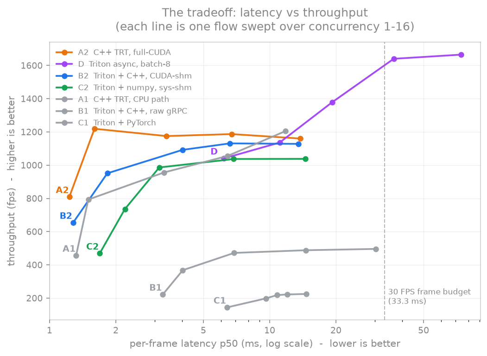
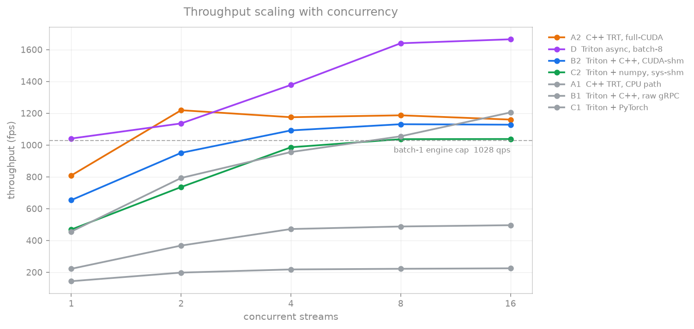

# Results — capacity and latency

[← index](../README.md) · prev: [Methodology](methodology.md) · next: [DeepStream](deepstream.md)

All flows run the **same YOLOv8s FP16 model**. Flow IDs are defined in the
[contenders table](../README.md#the-contenders). Read
[how to read the tables](methodology.md#how-to-read-the-tables) first.

---

*The whole study in one plot.* Up and to the left is better. **A2** reaches the
top-left corner — lowest latency at high throughput. **D** climbs highest but
walks right as it does: its throughput is bought with queue wait, and past
concurrency 4 it crosses the 30 FPS frame budget. The grey flows (A1/B1/C1) are
dominated everywhere — they are what "just use the server" or "just use Python"
costs if you feed them naively.

## Capacity results

Two numbers per cell. **`fps↑` = throughput (higher is better) · `ms↓` = per-frame
latency p50 (lower is better)**. Best value per row is **bold**.

| Concurrency | A1 — C++ TRT, CPU path | A2 — C++ TRT, full-CUDA | B1 — Triton+C++ gRPC | B2 — Triton+C++ CUDA-shm | C1 — Triton+PyTorch | C2 — Triton+Py numpy+shm | D — Triton async, batch-8 |
|---|---|---|---|---|---|---|---|
| 1 | 456↑ · 1.32↓ | 809↑ · **1.23↓** | 222↑ · 3.27↓ | 654↑ · 1.28↓ | 144↑ · 6.4↓ | 469↑ · 1.69↓ | **1041↑** · wait 6.2↓svc 0.61 |
| 2 | 793↑ · 1.50↓ | **1219↑ · 1.60↓** | 368↑ · 4.03↓ | 951↑ · 1.83↓ | 198↑ · 9.6↓ | 736↑ · 2.20↓ | **1136↑** · wait 11.1 svc 0.61 |
| 4 | 956↑ · 3.31↓ | **1175↑ · 3.40↓** | 472↑ · 6.90↓ | **1092↑ · 4.02↓** | 218↑ · 10.8↓ | 986↑ · 3.15↓ | **1378↑** · wait 19.2 svc 0.61 |
| 8 | 1055↑ · 6.43↓ | **1187↑ · 6.72↓** | 488↑ · 14.6↓ | **1131↑ · 6.60↓** | 222↑ · 12.0↓ | 1037↑ · 6.86↓ | **1640↑** · wait 36.6 svc 0.61 |
| 16 | 1205↑ · 11.8↓ | 1160↑ · 13.8↓ | 496↑ · 30.4↓ | **1128↑ · 13.5↓** | 225↑ · 14.7↓ | 1038↑ · 14.5↓ | **1665↑** · wait 73.9 svc 0.61 |

**Row winners.** For throughput: D (1665) > A2 (1219, saturates ~1200 from conc=2)
> B2 (1131) > C2 (1038) > B1 (496) > C1 (225). For latency: A2 (1.23 ms at
conc=1, 1.60 at conc=2) < B2 < C2 < D's wait (6.2–73.9).

**A2's notable shape**: it hits its ~1200 fps plateau already at conc=2 (multiple
CUDA streams overlap H2D/compute/D2H) and latency then scales linearly with N — a
batch-1 engine cannot exceed its 1028 qps core for long.

**D's cost is visible in the same row**: at conc=16 a frame waits 74 ms, more than
2 camera frames at 30 FPS. See [batching](batching.md).

GPU util at conc=16: A2 81% · B2 84% · C2 82% · D 79% (Triton-without-shm was 52%).

Read against the dashed engine cap: **A2 plateaus immediately** (it is at its
ceiling by concurrency 2 and never improves), while **D keeps climbing** because
batching amortises the GPU pass across 8 frames. B2 tracks A2 about 60 fps
behind. Everything below the cap line is losing to the engine, not to the GPU.

## Latency-first view (live 30 FPS camera: budget = 33.3 ms/frame)

If your feed is 30 FPS live video, latency under 33 ms is what matters — only D at
conc≥4 starts eating multiple frame budgets.

| Flow | p50 | % of budget | p95 | fps @ 1 stream | fps @ 3 streams |
|---|---|---|---|---|---|
| A2 | **1.25 ms** | 3.8% | 1.27 ms | ~20-23 | — |
| **E1 DeepStream** | **1.50 ms** | 4.5% | 1.59 ms | 45 | — |
| B2 | 1.55 ms | 4.7% | 1.73 ms | ~12 | — |
| C2 | ~2-8 ms | 6-24% | — | ~8-20 | — |
| D | 6.2-74 ms | 19-220% | — | — | — |

At 30 FPS *every* flow keeps up; the differences are in latency headroom.

## Per-frame efficiency — the fair unit for D

Per-frame GPU cost = GPU pass time ÷ frames per pass:

| Flow | Frames per GPU pass | GPU time/pass | **GPU cost per frame** | Client+server overhead per frame |
|---|---|---|---|---|
| A2 | 1 | 0.97 ms | **0.97 ms** | ~0.26 ms (in-process) |
| B2 | 1 | 0.97 ms | **0.97 ms** | ~0.31 ms (CUDA shm round trip) |
| C2 | 1 | 0.97 ms | **0.97 ms** | ~0.72 ms (sys-shm round trip) |
| D  | 8 | 4.84 ms | **0.61 ms** | batch window ~1–5 ms + round trip |

D's GPU is **37% cheaper per frame** (0.61 vs 0.97 ms) because one pass shares
weights/memory across 8 frames. That efficiency is the entire reason its fps is
higher; it costs 5–70 ms of queue latency per frame to realize it.

## One line per flow

- **A2** — lowest latency, in-process control. 809 fps single, 1.23 ms.
- **B2** — Triton without the tax (CUDA shm): 654–1131 fps, 1.28 ms.
- **C2** — Python without the tax (numpy + sys-shm + processes): 1038 fps, 1.69 ms.
- **D** — GPU-efficient batching: 0.61 ms/frame GPU cost, 1665 fps, 6–70 ms wait.

Raw data: [`results/`](../results/README.md) · full fair tables:
[`results/comparison_tables.md`](../results/comparison_tables.md).

---

[← index](../README.md) · prev: [Methodology](methodology.md) · next: [DeepStream](deepstream.md)
