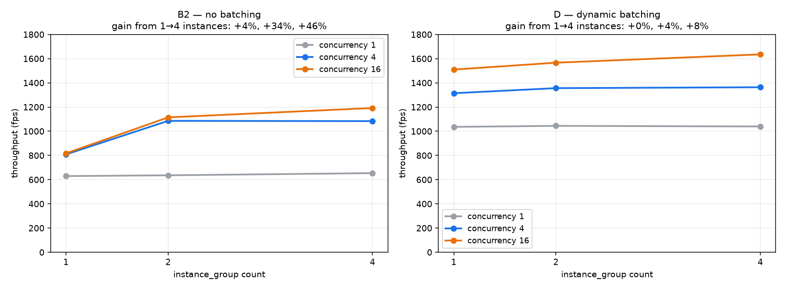

# Triton tuning — the knobs the study fixed without justifying

[← index](../README.md) · prev: [Batching](batching.md) · next: [CUDA graphs](cuda-graphs.md)

Two settings were hardcoded across every measurement in this study and never
swept: `instance_group count` (always 2) and CUDA graphs (never enabled). This
page tests both.

Measured on flow **B2** (`trt_grpc_cuda`, CUDA shared memory) against yolov8s at
4 concurrent streams, 3 repeats per cell, server restarted for each config.
Script: [`scripts/triton_knobs.sh`](../scripts/triton_knobs.sh) ·
raw data: [`results/v3/triton_knobs.tsv`](../results/v3/triton_knobs.tsv).

---

## Result

| `instance_group count` | CUDA graphs | fps | p50 | p95 |
|---|---|---|---|---|
| 1 | off | 810.4 | 4.29 ms | 6.36 ms |
| 1 | **on** | **920.2** (+13.6%) | 4.25 ms | **4.35 ms** (−31.6%) |
| 2 | off | 1056.4 | 4.04 ms | 4.54 ms |
| 2 | **on** | 1089.1 (+3.1%) | 3.99 ms | 4.35 ms |
| 4 | off | 1080.9 | 3.71 ms | 4.59 ms |
| 4 | on | **server fails to start** — see below |

## 1. `count: 2` was the right call — and 4 is not better

Going 1 → 2 instances is worth **+30.4%** (810 → 1056 fps). Going 2 → 4 buys
**+2.3%** (1056 → 1081), for double the GPU memory and a longer startup.

The study's hardcoded `count: 2` is validated, not just inherited. Worth stating
explicitly, since it was previously an unexamined constant sitting underneath
every Triton number in the report.

## 2. CUDA graphs and multiple instances are substitutes, not additives

This is the interesting one. [At the engine level](cuda-graphs.md), CUDA graphs
were worth **+14.9%** on yolov8s. In the server:

- with **1 instance**: **+13.6%** — the engine-level gain arrives essentially intact
- with **2 instances**: **+3.1%** — most of it is already gone
- with **4 instances**: nothing left to win (and it fails to start)

Both mechanisms attack the same cost. CUDA graphs *remove* per-launch overhead;
multiple instances *hide* it by overlapping one instance's launch gap with
another's compute. Once two instances overlap, the launch bubbles are already
filled, so graphs have little left to recover.

> **The practical reading:** you do not get to add these two optimizations
> together. If you already run ≥2 instances, CUDA graphs buy you ~3% of
> throughput, not ~15%. Budget accordingly.

## 3. Where graphs still earn their place: tail latency

At `count: 1`, graphs cut **p95 from 6.36 ms to 4.35 ms (−31.6%)** while p50
barely moves (4.29 → 4.25). Launch overhead is not a constant tax — it is a
source of *jitter*, and removing it flattens the tail far more than it shifts the
median.

That matters more than the throughput number for a latency-SLA deployment: the
p95 improvement survives even at `count: 2` (4.54 → 4.35 ms) where the throughput
gain has essentially vanished.

## 4. `count: 4` + graphs takes the whole server down

Not a graceful degradation — Triton refuses to start:

```
IExecutionContext::enqueueV3: Error Code 1: Cask (Cask convolution execution)
unable to record CUDA graph for yolov8s_0_2
unable to finish CUDA graph for yolov8s_0_2: operation failed due to a previous
  error during capture
error: creating server: Internal - failed to load all models
```

Graph capture fails on the third instance, and because Triton treats a failed
model load as fatal, **the server exits rather than falling back to non-graph
execution.** If you enable graphs in production, treat instance count as part of
the same change and test them together — a config that works at `count: 2` can
hard-fail at `count: 4`.

## 5. Instances across the concurrency range — and why D barely cares

Everything above was measured at **one operating point**: B2, four streams. That
is one cell of a grid, and `count: 2` was declared "the right call" from it. Run
the grid — three instance counts x three concurrencies x both server flows — and
the single number splits into two quite different stories.



| Flow | Concurrency | count=1 | count=2 | count=4 | gain 1→4 |
|---|---:|---:|---:|---:|---:|
| **B2** | 1 | 629.4 | 635.9 | 653.8 | **+3.9%** |
| **B2** | 4 | 808.5 | 1085.8 | 1083.6 | **+34.0%** |
| **B2** | 16 | 817.1 | 1114.5 | 1192.0 | **+45.9%** |
| **D** | 1 | 1036.1 | 1044.4 | 1039.5 | **+0.3%** |
| **D** | 4 | 1314.2 | 1356.1 | 1363.6 | **+3.8%** |
| **D** | 16 | 1509.6 | 1566.4 | 1634.9 | **+8.3%** |

Script: [`instance_grid.sh`](../scripts/instance_grid.sh) ·
figure: [`plot_instance_grid.py`](../scripts/plot_instance_grid.py) ·
raw data: [`results/v3/instance_grid.tsv`](../results/v3/instance_grid.tsv).

**Three findings, none of which the single cell could show.**

**1. At concurrency 1, instances do nothing — for either flow.** +3.9% and +0.3%.
Obvious in hindsight: with one request in flight, every extra instance is idle.
This matters beyond the knob, because it clears a suspected confound. B2 runs
with two server-side instances while A2 at `--streams 1` has a single execution
context, so the published **A2 1.23 ms vs B2 1.28 ms** comparison looked like it
might be handing Triton double the resources. It is not: at concurrency 1 the
second instance contributes nothing, and that 0.05 ms really is framework
overhead.

**2. For B2, `count: 2` is worth far more than the original +30.4% suggested** —
+34% at four streams and +36% at sixteen, with `count: 4` adding little beyond
that (0% and +7%). The original conclusion holds and understates itself.

**3. For D, instances almost do not matter: +8.3% at best, against B2's +45.9%.**

### Why: instances and batching are substitutes

The reason D shrugs is that **it already has a mechanism for keeping the GPU
fed.** Instances and dynamic batching solve the same problem — get more than one
frame of work in front of the device at a time — and if one is doing the job the
other has nothing left to add.

Triton makes the trade visible. Watch the batch size D actually forms as
instances are added:

| Concurrency | count=1 | count=2 | count=4 |
|---|---:|---:|---:|
| 4 | **5.41** | 4.00 | 4.00 |
| 16 | **7.91** | 6.27 | 6.13 |

With one instance, requests queue longer and **bigger batches form**. With four,
they are picked up sooner and batches stay small. Throughput lands in the same
place either way — the scheduler trades one against the other to reach the same
ceiling.

That is the second such pair on this page. [Section 2](#2-cuda-graphs-and-multiple-instances-are-substitutes-not-additives)
found CUDA graphs and instances are substitutes rather than additives. So:

> **Instances, CUDA graphs and dynamic batching are three mechanisms for one
> problem — keeping the GPU busy. Pull whichever lever suits your latency
> budget, then stop; the second and third are mostly redundant.**

Which reframes the tuning advice. The question is not "have I turned everything
on", it is "which *one* of these fits my latency constraint" — batching if you
can afford the wait, instances if you cannot, graphs if you need the tail.

## Not covered

- Only yolov8s and only flow B2. Flow D's dynamic-batch engines need graph capture
  per batch size (`graph_spec`) and were not tested.
- `preferred_batch_size` and `max_queue_delay_microseconds` are still fixed at
  `[4,8]` / 5000 µs — see [batching](batching.md).
- Model warmup, response cache, rate limiter, and NVIDIA's Model Analyzer remain
  untouched; see [roadmap](roadmap.md).

---

[← index](../README.md) · prev: [Batching](batching.md) · next: [CUDA graphs](cuda-graphs.md)
